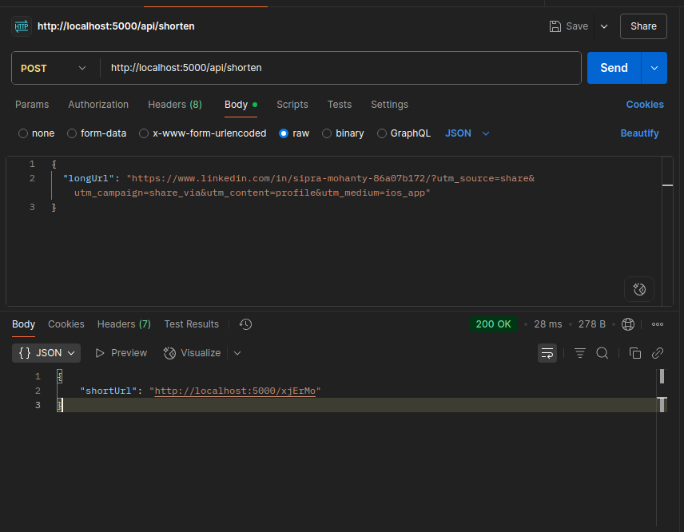

# 🔗 URL Shortener — Node.js + PostgreSQL + Redis

A production-ready backend system that converts long URLs into short links, inspired by services like Bit.ly. Built using Node.js, Express, PostgreSQL, and Redis — with complete system design, caching strategy, and real-world error handling.

---

## 🚀 Features

- ✅ Create a short URL from a long one
- 🔁 Redirect short URL to original long URL
- 🧠 Redis cache for fast redirection
- 🗃 PostgreSQL for persistent storage
- 📦 Structured using MVC + Service Layer architecture
- 🧪 Tested via Postman
- 🛠 Docker & deployment-ready

---

## 🏗 Tech Stack

| Layer       | Tech            |
|-------------|-----------------|
| Backend     | Node.js, Express|
| Database    | PostgreSQL      |
| Cache       | Redis           |
| ID Generator| NanoID          |
| Dev Tools   | Postman, nodemon|

---

## 📁 Project Structure

    url-shortener/
    ├── src/
    │ ├── controllers/ # Request handling
    │ ├── services/ # Business logic
    │ ├── repositories/ # DB logic (can be added later)
    │ ├── routes/ # API routes
    │ ├── config/ # Redis & DB setup
    │ ├── utils/ # Base62/NanoID
    │ └── app.js # App bootstrapping
    ├── .env # Environment vars
    ├── index.js # Entry point
    ├── package.json
    └── README.md

---

## 🧪 API Endpoints

### ➕ POST `/api/shorten`
```json
{
  "longUrl": "https://example.com"
}
```
Returns: `{ "shortUrl": "http://localhost:5000/abc123" }`

### GET /:shortCode
Redirects to the original long URL.

### GET /api/all (dev only)
Returns all entries from the database in JSON.

## Errors Faced & What I Learned

| Error                          | Cause                                | Fix                                        | Learning                                          |
|--------------------------------|--------------------------------------|--------------------------------------------|--------------------------------------------------|
| permission denied for schema public | User `sidd` didn’t have schema rights | Used `GRANT ALL ON SCHEMA public TO sidd`  | Understood Postgres schema & user permissions    |
| password authentication failed  | Wrong `.env` values                  | Updated `PG_USER` and `PG_PASSWORD`        | Learned how `.env` securely connects app to DB   |
| Cannot GET /xjErMo              | Route not found due to `/api` prefix | Moved `app.get('/:code')` outside `/api`   | Learned Express route scope and redirect routing |
| Redis not connecting            | Client setup error or wrong host/port | Used new Redis client with `connect()` method | Understood Redis async connection lifecycle      |
| Did not find any relations      | Table wasn’t created yet            | Ran correct SQL as proper user            | Learned DB init steps via CLI                    |


## Learnings

- 💡 PostgreSQL user, role, and schema management
- ⚙️ Connecting Node.js with relational DBs
- 🚀 Redis caching for speed optimization
- 🔄 Clean route/controller/service separation
- 🛠 Debugging real-world backend errors
- 📐 Applying system design in code

## To-Do / Extendable Features

- 📊 Click tracking
- 📅 URL expiry
- 🧑‍💼 Admin dashboard (React or Angular)
- 📦 Dockerize and deploy on Render or Railway
- ⚔️ Add rate-limiting to prevent abuse

## System Design in Action

- Redis for read-heavy optimization
- PostgreSQL for permanent storage
- Service layer separates business logic from route logic
- Easily pluggable with frontend or third-party apps

## Demo Screenshot


## Author
Siddharth Singh
[Linkedin](https://www.linkedin.com/in/siddharth1599/ "Let's connect on linkedin");